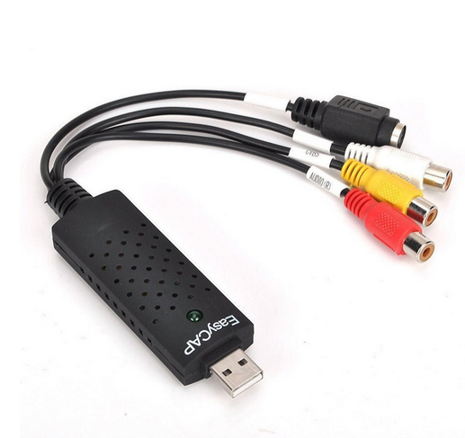

# Encode-Stream
A BASH Script to encode VHS / Camera / Cassette Streams

## *Basics*
This script file is designed for use by any-user (no root access required) within a Terminal. It’s principal purpose is to make it easy & reliable to encode a stream from a VHS, Camera or Cassette player to disk. It has been used extensively by myself to transfer all my VHS tapes as MP4 (using a EasyCAP UTV007 USB converter - example below) & cassettes as MP3 (using a USB-powered cassette player) to disc under *Devuan* (a systemD-free version of *Debian*). In addition to BASH, the main utility required is FFMPEG. Note that zero efforts are made to test for the presence of FFMPEG before use.


## *Begin*
The following will assume that you have created a dir `~/.local/sbin` within which you store the bash-file; this is to set the script as executable for current user only:

```
$ chmod 0700 ~/.local/sbin/encode_stream
$ la ~/.local/sbin/add_chapters
-rwx------ 1 user user 5846 Dec 21  2021 /home/user/.local/sbin/encode_stream
```
## *Help*
Attempting to run the bare script with zero parameters shows a Help message:

```bash
$ ~/.local/sbin/encode_stream
!Fatal Error! No OUTPUT_NAME in command.

usage: /home/user/.local/sbin/encode_stream OUTPUT_NAME [AUDIO_DEVICE] [VIDEO_DEVICE] [REGION] [PIX_FMT]

Encodes input from a VHS / Camera / Cassette stream to a mp4 video.

   OUTPUT_NAME     filename of mp4 video       (DEFAULT; no need for mp4 suffix                   )
               or, filename of m4a sound file  (needs m4a suffix                                  )
               or, filename of mp3 sound file  (needs mp3 suffix                                  )
   VIDEO_DEVICE    eg '/dev/video0' (try "v4l2-ctl --all"                                         )
   AUDIO_DEVICE    eg 'hw:2,0'      (try "arecord -l" or "arecord -L" or "cat /proc/asound/cards" )
   REGION          eg 'PAL'         (qv4l2 tool (QT v4l2 test utility) will help test for Region  )
   PIX_FMT         eg 'yuv420p'     (v4l2 default is yuyv422; will prevent display on some devices)

Note:
  Only use "q" to quit from the running process in the terminal
```
## *Overview*
Use the QT V4L2 test Utility (available from `menu:Multimedia | QT V4L2 test Utility`) whilst a stream is in action. The idea is that if you can see/hear the stream in that window, then `encode_stream` will also work fine. The only items that you need to know (or to change in the window) are `VIDEO_DEVICE`, `AUDIO_DEVICE` + `REGION`. For myself, the default in the qv4l2 window was *NTSC*, whilst the video I was playing was encoded under *PAL*. The window was black & silent until I changed the Region to *PAL* & then it played fine, as did the script.

The following will help discover the audio device    
(below is output from a problematic MacroSilicon MS210x Capture device; the device is card 2, device 0, which means that the hardware is 'hw:2,0'):–
```
$ arecord -l
**** List of CAPTURE Hardware Devices ****
card 1: Generic [HD-Audio Generic], device 0: ALC887-VD Analog [ALC887-VD Analog]
  Subdevices: 1/1
  Subdevice #0: subdevice #0
card 1: Generic [HD-Audio Generic], device 2: ALC887-VD Alt Analog [ALC887-VD Alt Analog]
  Subdevices: 1/1
  Subdevice #0: subdevice #0
card 2: MS210x [MS210x], device 0: USB Audio [USB Audio]
  Subdevices: 1/1
  Subdevice #0: subdevice #0
```

## *Software*
You may need to install ffmpeg.    
You may need to install Video for Linux (`v4l-utils` + `qv4l2` as a minimum):–
```bash
$ apt search v4l
Sorting... Done
Full Text Search... Done
…
dov4l/stable,now 0.9+repack-1+b1 amd64 [installed]
  program to set and query settings of video4linux devices

dv4l/stable,now 1.0-5+b2 amd64 [installed]
  Redirect V4L API to access a camcorder from a V4L program

libv4l-0/stable,now 1.22.1-5+b2 amd64 [installed,automatic]
  Collection of video4linux support libraries

libv4l2rds0/stable,now 1.22.1-5+b2 amd64 [installed,automatic]
  Video4Linux Radio Data System (RDS) decoding library

libv4lconvert0/stable,now 1.22.1-5+b2 amd64 [installed,automatic]
  Video4linux frame format conversion library

qv4l2/stable,now 1.22.1-5+b2 amd64 [installed]
  Test bench application for video4linux devices

v4l-conf/stable,now 3.107-1.1 amd64 [installed]
  tool to configure video4linux drivers

v4l-utils/stable,now 1.22.1-5+b2 amd64 [installed]
  Collection of command line video4linux utilities
```

## *Hardware*
This may be the hardest part.    
I chose *EasyCAP UTV007* because others had reported that it was recognised by Linux & did the job (which it did). If you have any problems at this stage I cannot help, but *can* report on what happens in the background.

Plugging your USB2 capture device into your desktop computer *should* auto-create video + audio devices via the interaction of V4L with the kernel:–
```
$ ls -l /dev/video*
crw-rw----+ 1 root video 81, 0 Sep 12 08:34 /dev/video0
crw-rw----+ 1 root video 81, 1 Sep 12 08:34 /dev/video1
```
With a VHS player the stream outputs through `video0` whilst `video1` is `null`. Normally a non-root user gets a `video` group-id added to their user and that will give permission to receive the stream. `id` can check for this:–
```
$ id
uid=1000(alexk) gid=1000(alexk) groups=1000(alexk),24(cdrom),25(floppy),27(sudo),29(audio),30(dip),
44(video),46(plugdev),102(netdev),109(lpadmin),111(scanner)
```
If things are going south fast, or you simply are curious, make use of V4L    
(what follows is output from a [problematic MacroSilicon MS210x Capture device](https://dev1galaxy.org/viewtopic.php?id=5981); sorry for the length)

What follows gives us the following information:

| *Type* | *Value* |
|---:|---|
| Model | AV TO USB2.0 |
| Width x Height | 640 x 480 |
| fps | 30.000 (30/1) |

At this moment (15 Sep 2023) the stream-encode script works fine with 25fps PAL imput. `ffmpeg` *should* be able to take NTSC imput at 30fps & render it OK. I would like to work with someone to check the script for NTSC. However, this device is currently unable to produce a viable stream within `qv4l2`, so that is not possible.

Launch the following within a terminal to obtain the info as above:–
```
$ v4l2-ctl --all
Driver Info:
	Driver name      : uvcvideo
	Card type        : AV TO USB2.0
	Bus info         : usb-0000:01:00.0-6
	Driver version   : 6.5.2
	Capabilities     : 0x84a00001
		Video Capture
		Metadata Capture
		Streaming
		Extended Pix Format
		Device Capabilities
	Device Caps      : 0x04200001
		Video Capture
		Streaming
		Extended Pix Format
Media Driver Info:
	Driver name      : uvcvideo
	Model            : AV TO USB2.0
	Serial           : 20150130
	Bus info         : usb-0000:01:00.0-6
	Media version    : 6.5.2
	Hardware revision: 0x00000121 (289)
	Driver version   : 6.5.2
Interface Info:
	ID               : 0x03000002
	Type             : V4L Video
Entity Info:
	ID               : 0x00000001 (1)
	Name             : AV TO USB2.0
	Function         : V4L2 I/O
	Flags            : default
	Pad 0x01000007   : 0: Sink
	  Link 0x0200000d: from remote pad 0x100000a of entity 'Processing 2' (Video Pixel Formatter): Data, Enabled, Immutable
Priority: 2
Video input : 0 (Camera 1: ok)
Format Video Capture:
	Width/Height      : 640/480
	Pixel Format      : 'MJPG' (Motion-JPEG)
	Field             : None
	Bytes per Line    : 0
	Size Image        : 614400
	Colorspace        : sRGB
	Transfer Function : Rec. 709
	YCbCr/HSV Encoding: ITU-R 601
	Quantization      : Default (maps to Full Range)
	Flags             : 
Crop Capability Video Capture:
	Bounds      : Left 0, Top 0, Width 640, Height 480
	Default     : Left 0, Top 0, Width 640, Height 480
	Pixel Aspect: 1/1
Selection Video Capture: crop_default, Left 0, Top 0, Width 640, Height 480, Flags: 
Selection Video Capture: crop_bounds, Left 0, Top 0, Width 640, Height 480, Flags: 
Streaming Parameters Video Capture:
	Capabilities     : timeperframe
	Frames per second: 30.000 (30/1)
	Read buffers     : 0
```
